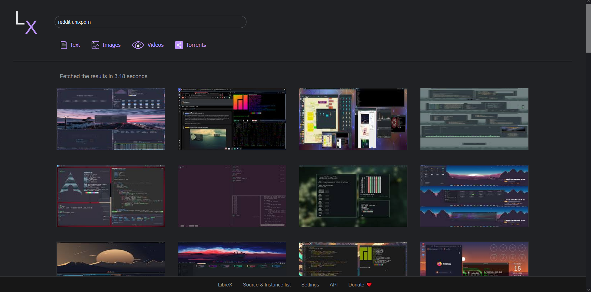

<!--
N.B.: This README was automatically generated by https://github.com/YunoHost/apps/tree/master/tools/README-generator
It shall NOT be edited by hand.
-->

# LibreX for YunoHost

[](https://dash.yunohost.org/appci/app/librex)  

[](https://install-app.yunohost.org/?app=librex)

*[Lire ce readme en français.](./README_fr.md)*

> *This package allows you to install LibreX quickly and simply on a YunoHost server.
If you don't have YunoHost, please consult [the guide](https://yunohost.org/#/install) to learn how to install it.*

## Overview

LibreX gives you results from Google, Qwant and popular torrent sites without spying on you. 

### Features

- Ad & JavaScript free
- Torrent results from popular torrent sites
- Tracking snippets from URLs are removed
- Popular social media sites (YouTube, Instagram, Twitter etc.) are replaced with privacy friendly front-ends
- No 3rd party libs are used


**Shipped version:** 2023.06.16~ynh3

**Demo:** https://librex.beparanoid.de

## Screenshots



## Documentation and resources

* Official admin documentation: <https://github.com/hnhx/librex/wiki>
* Upstream app code repository: <https://github.com/hnhx/librex>
* YunoHost documentation for this app: <https://yunohost.org/app_librex>
* Report a bug: <https://github.com/YunoHost-Apps/librex_ynh/issues>

## Developer info

Please send your pull request to the [testing branch](https://github.com/YunoHost-Apps/librex_ynh/tree/testing).

To try the testing branch, please proceed like that.

``` bash
sudo yunohost app install https://github.com/YunoHost-Apps/librex_ynh/tree/testing --debug
or
sudo yunohost app upgrade librex -u https://github.com/YunoHost-Apps/librex_ynh/tree/testing --debug
```

**More info regarding app packaging:** <https://yunohost.org/packaging_apps>
